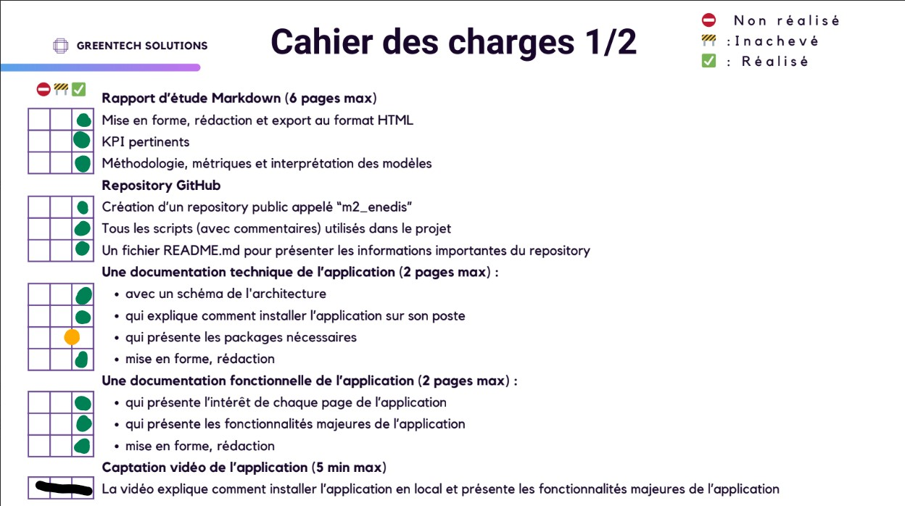
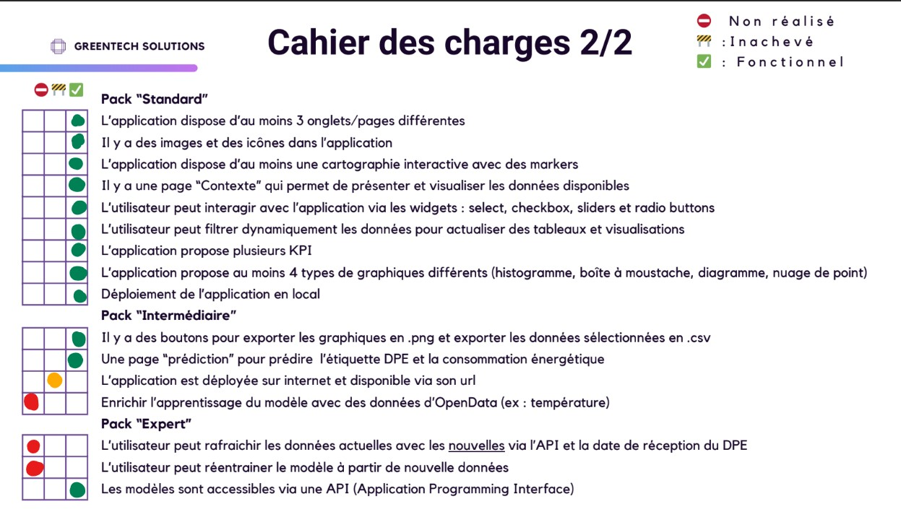

# m2_enedis
Enedis nous sollicite en vue d'évaluer l'impact de classe de Diagnostic de Performance Energétique (DPE) sur la consommations éléctriques  de logements. 

## OBJECTIFS 

### 1. Analyse des performances énergétiques des bâtiments (DPE) :

Analyser les caractéristiques des bâtiments (année de construction, superficie, etc.) et leurs performances énergétiques (DPE) afin d’identifier les facteurs influençant la consommation d’énergie.

### 2. Modèle de prédiction de la classe énergétique (DPE) :

Concevoir un modèle permettant de prédire la classe énergétique d’un bâtiment (A, B, C, D, E ou F) en fonction de ses caractéristiques.

### 3. Modèle de prédiction de la consommation d’énergie :

Développer un modèle permettant de prédire la consommation énergétique finale totale d’un bâtiment, en kWh/hef/an, pour le type d’énergie considéré. L’application utilise un modèle de régression pour effectuer ces prédictions.


## INSTALLATION 

L'installation requiert :
- Python 3.8 (ou splus récent)
- Un éditeur de code
- Un environnement virtuel (recommandé) : voir le fichier requirements.txt

### Marche à suivre

1. Lancer l'application :

2. Docker :
```bash
docker pull miligp12/ml-project-streamlit:latest
```
et lancer : 
```bash
docker run -d -p 8501:8501 miligp12/ml-project-streamlit:latest
```
3. Lancer sur StreamlitCloud :
   
https://m2enedis-u6bk7ax22n5cevhr2y9chf.streamlit.app/

Pour des informations complémentaires, vous référez à la rubrique Documentation plus bas.


## UTILISATION

Une fois installée, l'application est prête à l'emploi. Ses principales fonctionnalités sont :

- Prédiction de la consommation énergétique : Saisissez les caractéristiques d'un bâtiment pour prédire sa consommation énergétique grâce aux modèles d'apprentissage automatique pré-entraînés.

- Prédiction du DPE : Prédiser le diagnostic de performance énergétique (DPE) d'un bâtiment.

- Carte interactive : Visualiser et explorer les données relatives aux bâtiments et à leurs profils énergétiques sur une carte du département du Rhône (69).

- Graphiques et tableaux : Explorer différentes informations grâce à des graphiques et des tableaux interactifs.

## PACKAGES 

La liste des packages est disponible dans le fichier requirements.txt et inclut des bibliothèques telles que :

- Streamlit : pour la création d’applications web interactives.

- Plotly : pour la création de graphiques et de tracés interactifs.

- Scikit-learn : pour les modèles d’apprentissage automatique.

- Pandas, NumPy : pour la manipulation et le traitement des données. 

Pour installer les dépendances, il suffit d’exécuter la commande suivante :

## MODELES

Vous pouvez les télécharger à partir du lien suivant : [modèles](https://github.com/miligp/m2_enedis/tree/main/Modeles)


## DOCUMENTATION

Vous pouvez vous référer au document ce trouvant sur ce lien : [documentation](https://github.com/miligp/m2_enedis/blob/main/Documentation_Technique.md)

## 📋 Cahiers des Charges

###  Cahier des charges 1/2


### Cahier des charges 2/2  

