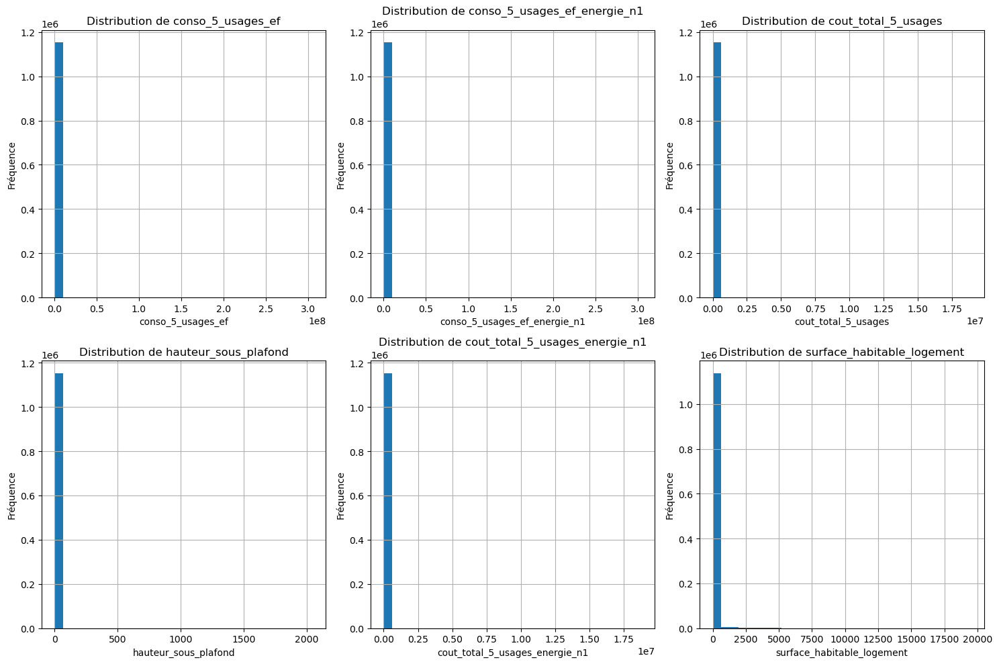
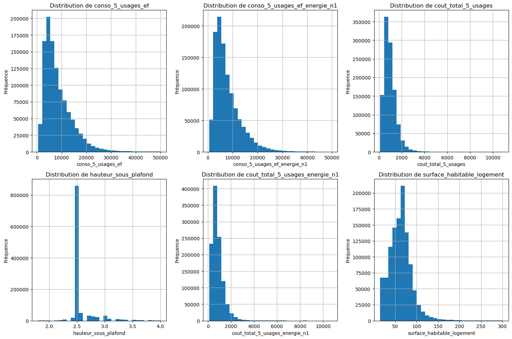
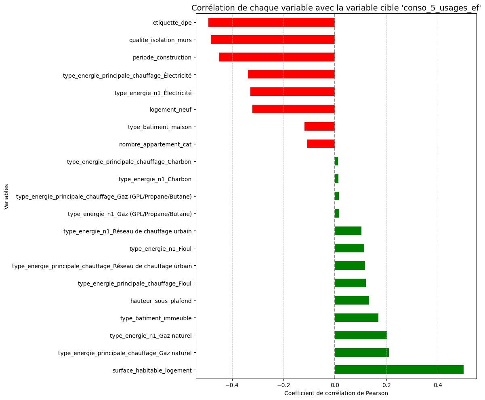
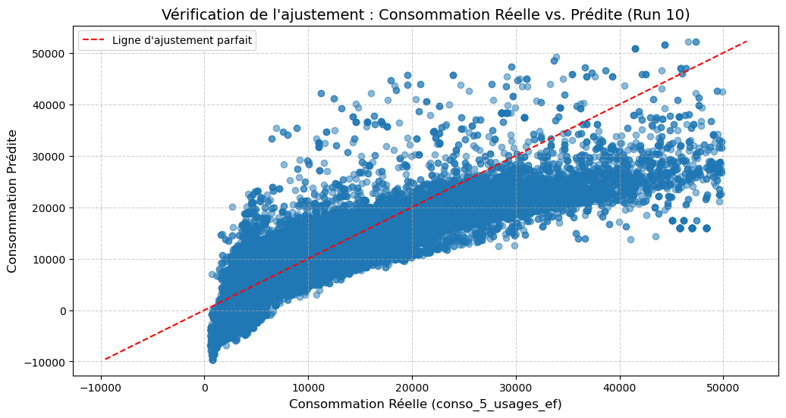

# RAPPORT METHODOLOGIQUE

Dans le cadre de notre projet, nous devions créer une interface permettant de prévoir et visualiser la consommation énérgétique et l'étiquette DPE d'un foyer en se basant sur des informations entrées par l'utilisateur. 
Ce rapport reprend les étapes principales de notre travail en expliquant, dans les grandes lignes, les méthodes et choix effectués, de l'acquisition des données jusqu'à leur utilisation dans la conception de nos modèles de prédiction.

##  1. ACQUISITION ET TRAITEMENT DES DONNEES


* L'acquisition des données s'est faite depuis l'API de l'ADEME sous la forme de deux jeux de données, l'un contenant des informations sur les logements neufs et l'autre sur des logements anciens.
Ces dataframes n'ayant pas la même structure, des transformations ont été effectuées disctinctement sur chaque dataframe dans un premier temps, elles seront abordées superficiellement dans un premier temps.
Une fois les deux dataframes joints pour n'en former qu'un seul, d'autres transformations ont effectuées et seront davantage expliquées dans un second temps.

* Afin de déterminer les variables requises dans cette étude, nous avons commencé par les classer comme suit : géographiques, types de chauffage, ECS (ce qui est relié à l'eau chaud), DPE-GES, logement, déperditions-isolation, autres.
  Cela nous a permis d'effectuer une préselection des variables en suivant deux axes :
  ** la variable sera-t-elle probante pour la création de nos modèles ?
  ** l'utilisateur sera-t-il en mesure de renseigner facilement cette donnée ? (et si oui, comment?)

### A. Traitement avant concaténation
#### 1. Valeurs manquantes
Dans les deux dataframes, des valeurs manquaient, surtout pour les variables 'complement_adresse_logement', 'annee_construction', 'nombre_appartement' et 'type_installation_chauffage' dans le dataframe contenant les logements anciens et pour 'surface_habitable_immeuble', 'nombre_niveau_logement' dans celui contenant les logements neufs.   

* Les lignes contenant les valeurs manquantes pour la variable 'type_installation_chauffage' ont été supprimées .
* La variable 'complement_adresse_logement' contient beaucoup de valeurs manquantes (22%), n'apportant pas une information nécessaire dans ce contexte, elle a été supprimée entièrement.
* La variable 'annee_construction' contient elle aussi beaucoup de valeurs manquantes(42%), puisque nous disposons de la variable 'période_construction', elle a été supprimée.
* Les lignes manquantes pour les variables 'surface_habitable_logement' et 'surface_chauffee_installation_chauffage_n1' ont été supprimées dans le dataframe des anciens logements. Pour éviter la redondance avec les deux précédentes, la variable 'surface_chauffee_installation_chauffage_n1' a été supprimée.


#### 2. Variables catégorielles complexes
* Dans les deux dataframe, la variable catégorielle 'type_energie_principale__chauffage' contient de trop nombreuses modalités, afin de réduire leur nombre elles ont été regroupées parmi celles-ci seulement : Gaz naturel, Electricité, Réseau de chauffage urbain, Bois et biomasse, Fioul, Gaz(GPL/Propane/Butane), Charbon.
* La variable 'type_energie_n1' a été traitée de la même façon.
* La variable 'configuration_installation_chauffage_n1' contenant beaucoup de modalités elle aussi, et s'avérant redondante avec les précédentes variables, a été supprimée afin d'éviter la multicolinéarité et de réduire le risque de surapprentissage par la suite.
* La variable 'type_generateur_chauffage_principal' contient trop modalités, pour les mêmes raisons que précédemment elle a aussi été supprimée.


#### 3. Variables géographiques
La variable geopoint a été splittée en deux variables : latitude et longitude. 


#### 4. Uniformisation des deux dataframes

* Une colonne 'logement' a été ajoutée aux deux dataframes, pour l'un elle contient la valeur 'ancien', pour l'autre la valeur 'neuf'.
* Une colonne 'période_construction' a aussi été créée dans le dataframe des logements neufs en y insérant la valeur 'après 2021' pour toutes les lignes.

### B. Traitement après concaténation

Le dataframe obtenu  contient 1152372 lignes et 30 colonnes.

#### 1. Valeurs manquantes

La variable 'nombre_appartement' contient 

#### 2. Encodage des variables ordinales

Les variables 'qualite_isolation_murs', 'etiquette_dpe', 'nombre_appartement_cat', 'periode_construction'ont été réencodées à l'aide d'un dictionnaire dont les clés sont les variables et les valeurs les modalités des variables. A l'aide d'une boucle, chaque modalité a été remplacée par la valeur de son index dans se liste de valeurs.

#### 3. Encodage des variables nominales

La variable 'type_batiment' contient trois modalités : 'appartement', 'immeuble' et 'maison'. Les modalités correspondant à 'immeuble' ont été ramenées sous la modalité 'appartement' de façon à réencoder simplement la variable.

#### 4. Variables quantitatives et valeurs aberrantes

Les variables quantitatives qui seront utilisées dans les modèles de prédiction, sont définies sur des amplitudes importantes du fait de valeurs aberrantes. Les algorithmes utilisés dans la création des modèles étant basés sur des calculs de distances, ils sont sensibles à ces écarts. Afin de réduire ceux-ci, les valeurs aberrantes ont été supprimées.

    Statistiques des variables quantitatives:
                                        mean        std    min     25%      50%  \
    conso_5_usages_ef               14443.94  572375.13  132.0  4341.7  6957.90   
    conso_5_usages_ef_energie_n1    13491.00  570719.26    1.0  4050.5  6414.65   
    cout_total_5_usages              1560.29   35667.75   38.3   598.9   879.60   
    hauteur_sous_plafond                2.61       4.29    0.2     2.5     2.50   
    cout_total_5_usages_energie_n1   1323.05   35316.31    0.0   492.3   733.60   
    surface_habitable_logement         92.11     323.88    1.0    45.0    62.90   
    
                                         75%          max  
    conso_5_usages_ef               11474.42  305858058.6  
    conso_5_usages_ef_energie_n1    10480.42  305142112.0  
    cout_total_5_usages              1255.50   18925018.0  
    hauteur_sous_plafond                2.50       2049.0  
    cout_total_5_usages_energie_n1   1077.03   18810120.0  
    surface_habitable_logement         77.60      19520.9  
    


    

    


    Nettoyage terminé. Shape final: (1110136, 30)
    Statistiques des variables quantitatives:
                                       mean      std    min     25%      50%  \
    conso_5_usages_ef               8527.54  5899.69  504.4  4344.5  6864.20   
    conso_5_usages_ef_energie_n1    7910.45  5539.21  519.0  4057.9  6346.05   
    cout_total_5_usages              978.85   567.25  114.0   598.0   870.30   
    hauteur_sous_plafond               2.58     0.22    1.8     2.5     2.50   
    cout_total_5_usages_energie_n1   839.96   534.03  100.0   493.4   726.70   
    surface_habitable_logement        62.65    26.52   15.0    45.0    62.30   
    
                                        75%      max  
    conso_5_usages_ef               11105.5  49988.4  
    conso_5_usages_ef_energie_n1    10177.1  49744.6  
    cout_total_5_usages              1225.0  10845.0  
    hauteur_sous_plafond                2.5      4.0  
    cout_total_5_usages_energie_n1   1050.7  10721.9  
    surface_habitable_logement         76.5    300.0  
    


    

    


## 2. Construction des modèles
### A. Modèles de régression linéaire(prévision consommation)
####  Variables retenues


On cherche ici à construire un modèle permettant de prévoir la consommation énergétique de l'utilisateur.

* Notre étude portant sur une zone se limitant à un département, nous écartons les variables géographiques dont l'influence est faible sur la cible : latitude et longitude .
* Il est important que les variables alors retenues n'aient pas une corrélation nulle avec la variable cible, la consommation.


    

    


#### 1. Régression linéaire non pénalisée : prévision de la consommation énergétique

On effectue la régression sur 10 runs avec une division entre train et test dans les proportions respectives de 80% et 20%, randomisée à chaque run.
Les résultats obtenus se trouvent ci-dessous :

    Nombre total d'observations après chargement: 1043068
    Nombre de variables du modèle: 21
    
    Modèle : Régression Linéaire Standard
    Évaluation de la stabilité du modèle sur 10 splits aléatoires (80/20)...
    Run 1/10: R2=0.7786, RMSE=2798.53
    Run 2/10: R2=0.7803, RMSE=2786.73
    Run 3/10: R2=0.7778, RMSE=2798.76
    Run 4/10: R2=0.7808, RMSE=2780.48
    Run 5/10: R2=0.7794, RMSE=2788.00
    Run 6/10: R2=0.7779, RMSE=2790.84
    Run 7/10: R2=0.7782, RMSE=2798.60
    Run 8/10: R2=0.7785, RMSE=2788.28
    Run 9/10: R2=0.7788, RMSE=2783.82
    Run 10/10: R2=0.7782, RMSE=2797.28
    
    ================================
    RÉSUMÉ DE LA STABILITÉ DU MODÈLE
    ================================
    Meilleur R2 : 0.7808
    Pire R2   : 0.7778
    R2 Moyen  : 0.7788
    Écart Type R2 : 0.0010
    
    =======================================
    COEFFICIENTS DU DERNIER MODÈLE ENTRAINE
    =======================================
                                                        Variable  Coefficient  Importance_Absolue
                                          type_batiment_immeuble   10406.8179          10406.8179
                                     type_energie_n1_Électricité   -5154.8270           5154.8270
                                         type_energie_n1_Charbon    4527.7597           4527.7597
                                      surface_habitable_logement    3328.1414           3328.1414
                                                   etiquette_dpe   -2806.1083           2806.1083
                                            type_batiment_maison   -2013.8749           2013.8749
                       type_energie_principale_chauffage_Charbon   -1660.5466           1660.5466
                         type_energie_principale_chauffage_Fioul    1376.7527           1376.7527
                                     type_energie_n1_Gaz naturel   -1361.4987           1361.4987
                      type_energie_n1_Réseau de chauffage urbain   -1315.6033           1315.6033
                                           type_energie_n1_Fioul   -1110.3532           1110.3532
      type_energie_principale_chauffage_Gaz (GPL/Propane/Butane)    -815.7459            815.7459
    type_energie_principale_chauffage_Réseau de chauffage urbain     757.2085            757.2085
                        type_energie_n1_Gaz (GPL/Propane/Butane)    -756.9495            756.9495
                   type_energie_principale_chauffage_Électricité    -605.9483            605.9483
                                          qualite_isolation_murs    -515.7051            515.7051
                                                   logement_neuf    -215.6440            215.6440
                                          nombre_appartement_cat    -186.8802            186.8802
                   type_energie_principale_chauffage_Gaz naturel    -137.1896            137.1896
                                            periode_construction    -124.9462            124.9462
                                            hauteur_sous_plafond     -23.1531             23.1531
    


    

    


Les scores obtenus par la régression sont satisfaisants avec une valeur moyenne de R2 égale à 0.7788. Autrement dit, la variabilité de la consommation énergétique est expliquée à 77.88% par les variables utilisées.
Toutefois, nous avons effectué une régression pénalisée afin d'éventuellement obtenir de meilleurs résultats.

#### 2. Régression linéaire régularisée

    
    --- Prétraitement et Split initial pour GridSearch ---
    Taille du jeu d'entraînement final (pour GridSearch): (730147, 21)
    

Nous avons commencé par chercher la meilleure valeur du coefficient de régularisation alpha parmi les valeurs suivantes : 0.0, 0.1, 1.0, 10.0, 100.0, 500.0, 1000.0 pour Ridge et Lasso.


    --- GridSearch pour optimiser Ridge et Lasso (Cible Brute) ---
    Fitting 5 folds for each of 7 candidates, totalling 35 fits
    
    Résultat Ridge:
    Meilleur alpha pour Ridge: 10.0000
    
    --- Test de Stabilité pour le meilleur modèle (Ridge, alpha=10.0) ---
    Évaluation sur 10 splits aléatoires (20% test)...
    Run 1/10: R2=0.7784, RMSE=2789.76
    Run 2/10: R2=0.7811, RMSE=2778.23
    Run 3/10: R2=0.7796, RMSE=2799.31
    Run 4/10: R2=0.7811, RMSE=2770.94
    Run 5/10: R2=0.7791, RMSE=2784.33
    Run 6/10: R2=0.7785, RMSE=2788.41
    Run 7/10: R2=0.7795, RMSE=2789.69
    Run 8/10: R2=0.7792, RMSE=2790.82
    Run 9/10: R2=0.7788, RMSE=2784.00
    Run 10/10: R2=0.7793, RMSE=2794.16
    
    ================================
    RÉSUMÉ DE LA STABILITÉ DU MODÈLE
    ================================
    Meilleur R2 : 0.7811
    Pire R2   : 0.7784
    R2 Moyen  : 0.7795
    Écart Type R2 : 0.0009
    


## Comparaison des Modèles de Régression

| Métrique | Non pénalisée | Ridge | Lasso |
| :--- | :--- | :--- | :--- |
| **Meilleur R²** | 0.7808 | **0.7811** | Donnée manquante |
| **Pire R²** | 0.7778 | 0.7784 | Donnée manquante |
| **R² Moyen** | 0.7788 | **0.7795** | Donnée manquante |
| **Écart Type R²** | 0.0010 | **0.0009** | Donnée manquante |

* Les données pour le modèle **Lasso** ne sont pas disponibles car nous ne sommes pas parvenus à obtnir sa convergence.
* Le modèle **Ridge** ($R^2$ Moyen de $0.7795$) est légèrement **plus performant** et **plus stable** (Écart Type $0.0009$) que le modèle Non pénalisé.
* Nous avons toutefois choisi de retenir le modèle de régression non pénalisée car il est plus simples à entraîner et mettre en oeuvre. 

### B. Modèle de classification : prévision de l'étiquette DPE

#### 1. Random Forest

Nous avons commencé par déterminer les meilleurs paramètres ('n_estimators': [100, 150, 200],'max_depth': [5, 10, None],'min_samples_split': [2, 5, 10]) à l'aide RandomizedSearchCV pour un échantillon de taille 50000 puis le test a été effectué sur l'échantillon complet.


```text
Processus d'Optimisation (Grid Search ou Random Search)
Fitting 4 folds for each of 5 candidates, totalling 20 fits

Meilleurs paramètres retenus pour l'estimateur (par exemple, Random Forest/Gradient Boosting)
Meilleurs paramètres : {'n_estimators': 100, 'min_samples_split': 5, 'max_depth': None}

Performance
Score CV (sur échantillon) : 0.92749
F1-score (sur jeu de test) : 0.93913

Top 10 variables les plus importantes :
                                 importance
surface_habitable_logement        0.293281
conso_5_usages_ef                 0.139925
conso_5_usages_ef_energie_n1      0.130542
cout_total_5_usages               0.115087
cout_total_5_usages_energie_n1    0.113221
qualite_isolation_murs            0.060687
nombre_appartement_cat            0.022642
hauteur_sous_plafond              0.022630
logement_neuf                     0.022483
type_energie_n1_gaz naturel       0.017938
```

On note ici un F1-score très elevé. Ceci s'explique par le fait que nous avions conservé les variables 'conso_5_usages_ef_energie_n1'  
'cout_total_5_usages' et 'cout_total_5_usages_energie_n1', très corrélées à la variable 'conso_5_usages_ef'. Elles n'ont pas été retenues par la suite.


```text

Entraînement sur 10 runs...

Run  1: F1-score = 0.7528
Run  2: F1-score = 0.7526
Run  3: F1-score = 0.7524
Run  4: F1-score = 0.7528
Run  5: F1-score = 0.7524
Run  6: F1-score = 0.7529
Run  7: F1-score = 0.7533
Run  8: F1-score = 0.7528
Run  9: F1-score = 0.7531
Run 10: F1-score = 0.7527

Moyenne des F1-scores : 0.7528
Écart-type : 0.0003


Rapport de classification :
              precision    recall  f1-score   support

            0       0.39      0.83      0.53      5453
            1       0.42      0.73      0.53      9677
            2       0.60      0.67      0.63     32202
            3       0.78      0.65      0.71     60306
            4       0.93      0.80      0.86     86398
            5       0.64      0.90      0.75     10045
            6       0.81      0.96      0.88      4533

     accuracy                           0.74    208614
    macro avg       0.65      0.79      0.70    208614
 weighted avg       0.78      0.74      0.75    208614
```

Le modèle obtenu est satisfaisant avec un F1-Score moyen égal à 0.75, que nous comparerons à la régression logistique effectuée ci-après.

#### 2. Régression logistique

    Fitting 2 folds for each of 5 candidates, totalling 10 fits
    Les meilleurs paramètres sont : {'penalty': 'l2', 'C': 10}
    

    
    Modèle : Régression Logistique
    Évaluation de la stabilité du modèle sur 10 avec des échantillons stratifiés d'entraînement de tailles respectives 5000 et 1000
    Nombre total d'observations après chargement: 1043068
    Nombre de variables du modèle: 28
    Entraînement sur 10 runs
    
    Run  1: F1-score = 0.7798
    Run  2: F1-score = 0.7798
    Run  3: F1-score = 0.7798
    Run  4: F1-score = 0.7798
    Run  5: F1-score = 0.7798
    Run  6: F1-score = 0.7798
    Run  7: F1-score = 0.7798
    Run  8: F1-score = 0.7798
    Run  9: F1-score = 0.7798
    Run 10: F1-score = 0.7798
    
     Moyenne des F1-scores : 0.7798
     Écart-type : 0.0
    

##### Comparaison des Performances F1-score (Stabilité sur 10 Runs)

| Modèle | Moyenne des F1-scores | Écart-type |
| :--- | :--- | :--- |
| **Rando Forest** | 0.7528 | **0.0003** |
| **Régression Logistique** | **0.7798** | 0.0 |

---

* Le modèle de **Régression Logistique** présente le **meilleur F1-score moyen** (0.7798).
* Il est également **parfaitement stable** sur les 10 runs (Écart-type de 0.0), ce qui est un excellent indicateur de robustesse.
* Le modèle **Random Forest** est moins performant en moyenne (0.7528) mais est également très stable (Écart-type de 0.0003).

### Synthèse

Le modèle retenu obtient un bon score mais il est à noter qu'il est plus à-même de prévoir les étiquettes C, D et E que les étiquettes "extrêmes", A,B,F et G .
Ceci peut s'expliquer par la caractère ordinal de la variable cible d'une part et par le caractère normal/gaussien de la distribution de la variable étiquette_dpe.
Nous n'avons pas eu le temps de les mettre en oeuvre mais avons néanmoins réfléchi à des pistes d'amélioration :
 * le rééchantillonage : utiliser SMOTE afin de générer des échantillons permettant d'équilibrer la distribution.
 * la pondération : pondérer favorablement les classes correspondant aux étiquettes A,B,F et G.

##  3. Interface 
